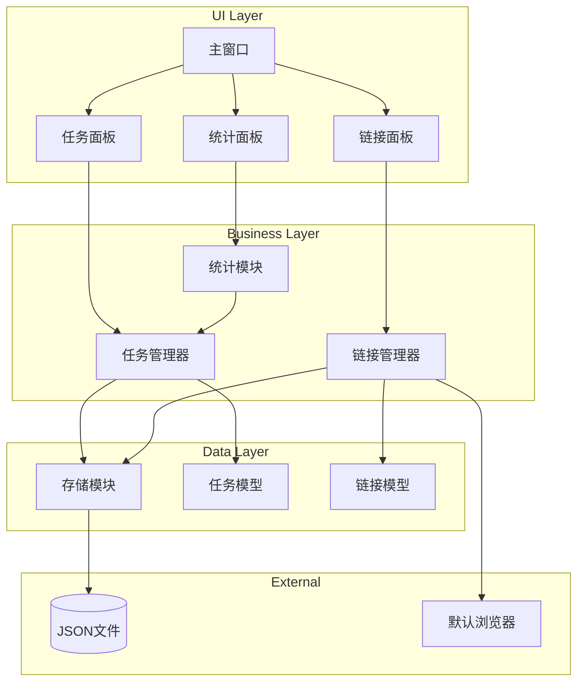

# Design Document: Personal Workbench

## Overview

个人工作台是一个基于 Python 的桌面应用程序，采用简约风格设计，帮助用户管理日常计划任务和常用网页链接。应用使用 Tkinter 作为 GUI 框架，JSON 文件作为数据持久化存储。

系统采用分层架构，将数据模型、业务逻辑和用户界面分离，确保代码的可维护性和可测试性。

## Architecture



## Components and Interfaces

### 1. 数据模型层

#### Task 类
```python
@dataclass
class Task:
    id: str                    # 唯一标识符 (UUID)
    title: str                 # 任务标题 (必填)
    description: str           # 任务描述 (可选)
    due_date: Optional[datetime]  # 截止日期 (可选)
    completed: bool            # 完成状态
    created_at: datetime       # 创建时间
    completed_at: Optional[datetime]  # 完成时间
    
    def to_dict(self) -> dict: ...
    
    @classmethod
    def from_dict(cls, data: dict) -> 'Task': ...
    
    def is_overdue(self) -> bool: ...
```

#### Link 类
```python
@dataclass
class Link:
    id: str          # 唯一标识符 (UUID)
    name: str        # 链接名称 (必填)
    url: str         # URL地址 (必填)
    created_at: datetime  # 创建时间
    
    def to_dict(self) -> dict: ...
    
    @classmethod
    def from_dict(cls, data: dict) -> 'Link': ...
```

### 2. 业务逻辑层

#### TaskManager 类
```python
class TaskManager:
    def __init__(self, storage: Storage): ...
    
    def create_task(self, title: str, description: str = "", 
                    due_date: Optional[datetime] = None) -> Task: ...
    
    def update_task(self, task_id: str, **kwargs) -> Task: ...
    
    def delete_task(self, task_id: str) -> bool: ...
    
    def complete_task(self, task_id: str) -> Task: ...
    
    def get_all_tasks(self) -> List[Task]: ...
    
    def get_pending_tasks(self) -> List[Task]: ...
    
    def get_completed_tasks(self) -> List[Task]: ...
    
    def get_overdue_tasks(self) -> List[Task]: ...
```

#### LinkManager 类
```python
class LinkManager:
    def __init__(self, storage: Storage): ...
    
    def add_link(self, name: str, url: str) -> Link: ...
    
    def update_link(self, link_id: str, **kwargs) -> Link: ...
    
    def delete_link(self, link_id: str) -> bool: ...
    
    def get_all_links(self) -> List[Link]: ...
    
    def open_link(self, link_id: str) -> bool: ...
    
    @staticmethod
    def validate_url(url: str) -> bool: ...
```

#### StatisticsModule 类
```python
class StatisticsModule:
    def __init__(self, task_manager: TaskManager): ...
    
    def get_total_count(self) -> int: ...
    
    def get_completed_count(self) -> int: ...
    
    def get_pending_count(self) -> int: ...
    
    def get_overdue_count(self) -> int: ...
    
    def get_completion_percentage(self) -> float: ...
    
    def get_statistics_summary(self) -> dict: ...
```

### 3. 数据持久化层

#### Storage 类
```python
class Storage:
    def __init__(self, file_path: str = "workbench_data.json"): ...
    
    def load(self) -> dict: ...
    
    def save(self, data: dict) -> bool: ...
    
    def get_tasks(self) -> List[dict]: ...
    
    def save_tasks(self, tasks: List[dict]) -> bool: ...
    
    def get_links(self) -> List[dict]: ...
    
    def save_links(self, links: List[dict]) -> bool: ...
```

### 4. 用户界面层

#### MainWindow 类
```python
class MainWindow:
    def __init__(self): ...
    
    def setup_ui(self) -> None: ...
    
    def create_menu(self) -> None: ...
    
    def create_task_panel(self) -> None: ...
    
    def create_link_panel(self) -> None: ...
    
    def create_stats_panel(self) -> None: ...
    
    def refresh_all(self) -> None: ...
    
    def run(self) -> None: ...
```

## Data Models

### JSON 存储格式

```json
{
  "version": "1.0",
  "tasks": [
    {
      "id": "uuid-string",
      "title": "任务标题",
      "description": "任务描述",
      "due_date": "2024-12-31T23:59:59",
      "completed": false,
      "created_at": "2024-01-01T10:00:00",
      "completed_at": null
    }
  ],
  "links": [
    {
      "id": "uuid-string",
      "name": "链接名称",
      "url": "https://example.com",
      "created_at": "2024-01-01T10:00:00"
    }
  ]
}
```

### 数据验证规则

| 字段 | 验证规则 |
|------|----------|
| Task.title | 非空字符串，去除首尾空格后长度 > 0 |
| Task.due_date | 有效的 datetime 或 None |
| Link.name | 非空字符串，去除首尾空格后长度 > 0 |
| Link.url | 符合 URL 格式 (http:// 或 https:// 开头) |


## Correctness Properties

*A property is a characteristic or behavior that should hold true across all valid executions of a system—essentially, a formal statement about what the system should do. Properties serve as the bridge between human-readable specifications and machine-verifiable correctness guarantees.*

### Property 1: Task Creation Adds to List

*For any* valid task title (non-empty string after trimming), creating a task with that title should result in the task list length increasing by one, and the new task should have `completed=False` status.

**Validates: Requirements 1.1**

### Property 2: Task Completion Updates State

*For any* pending task, marking it as complete should result in `completed=True` and `completed_at` being set to a non-null datetime value.

**Validates: Requirements 1.3**

### Property 3: Task Deletion Removes from List

*For any* task in the task list, deleting that task should result in the task no longer appearing in the task list, and the list length decreasing by one.

**Validates: Requirements 1.5**

### Property 4: Empty Title Rejection

*For any* string composed entirely of whitespace (including empty string), attempting to create a task with that string as title should be rejected, and the task list should remain unchanged.

**Validates: Requirements 1.6**

### Property 5: Link Addition Stores in Collection

*For any* valid link name (non-empty) and valid URL (http/https format), adding a link should result in the link collection length increasing by one, and the new link should be retrievable.

**Validates: Requirements 2.1**

### Property 6: Link Deletion Removes from Collection

*For any* link in the link collection, deleting that link should result in the link no longer appearing in the collection.

**Validates: Requirements 2.4**

### Property 7: Invalid URL Rejection

*For any* string that does not match valid URL format (not starting with http:// or https://), attempting to add a link with that URL should be rejected, and the link collection should remain unchanged.

**Validates: Requirements 2.5**

### Property 8: Empty Link Name Rejection

*For any* string composed entirely of whitespace (including empty string), attempting to add a link with that string as name should be rejected, and the link collection should remain unchanged.

**Validates: Requirements 2.6**

### Property 9: Statistics Calculation Correctness

*For any* set of tasks with mixed completion states, the Statistics_Module should correctly calculate: total_count equals the number of tasks, completed_count equals the number of tasks with `completed=True`, and completion_percentage equals `completed_count / total_count * 100` (or 0 if total is 0).

**Validates: Requirements 3.1, 3.2**

### Property 10: Overdue Task Identification

*For any* task with a due_date in the past and `completed=False`, the task should be identified as overdue by the `is_overdue()` method.

**Validates: Requirements 3.5**

### Property 11: Task Serialization Round-Trip

*For any* valid Task object, serializing to dict then deserializing back should produce an equivalent Task object with all fields preserved.

**Validates: Requirements 4.5**

### Property 12: Link Serialization Round-Trip

*For any* valid Link object, serializing to dict then deserializing back should produce an equivalent Link object with all fields preserved.

**Validates: Requirements 4.6**

### Property 13: Data Persistence Consistency

*For any* sequence of create/update/delete operations on tasks or links, the data saved to storage should accurately reflect the current state, and loading from storage should restore that exact state.

**Validates: Requirements 4.2, 4.4**

## Error Handling

### 输入验证错误

| 错误场景 | 处理方式 |
|----------|----------|
| 空任务标题 | 抛出 `ValueError("Task title cannot be empty")` |
| 空链接名称 | 抛出 `ValueError("Link name cannot be empty")` |
| 无效URL格式 | 抛出 `ValueError("Invalid URL format")` |
| 任务ID不存在 | 抛出 `KeyError("Task not found")` |
| 链接ID不存在 | 抛出 `KeyError("Link not found")` |

### 存储错误

| 错误场景 | 处理方式 |
|----------|----------|
| 存储文件不存在 | 创建新的空存储文件，返回空数据 |
| JSON解析失败 | 备份损坏文件，创建新存储，通知用户 |
| 文件写入失败 | 抛出 `IOError`，UI层显示错误提示 |

### UI错误处理

- 所有业务层异常在UI层捕获并显示友好的错误消息
- 使用 `messagebox.showerror()` 显示错误对话框
- 错误不应导致应用崩溃

## Testing Strategy

### 测试框架选择

- **单元测试**: pytest
- **属性测试**: hypothesis (Python 属性测试库)
- **覆盖率**: pytest-cov

### 测试分层

#### 1. 单元测试

针对具体示例和边界情况：
- 数据模型的基本创建和属性访问
- 特定日期的过期判断
- 特定格式的URL验证
- 空列表时的统计计算

#### 2. 属性测试

针对通用属性，每个属性测试运行至少100次迭代：

```python
# 示例：Task序列化往返测试
# Feature: personal-workbench, Property 11: Task Serialization Round-Trip
@given(st.text(min_size=1), st.text(), st.datetimes())
def test_task_serialization_roundtrip(title, description, created_at):
    task = Task(
        id=str(uuid.uuid4()),
        title=title.strip() or "default",
        description=description,
        due_date=None,
        completed=False,
        created_at=created_at,
        completed_at=None
    )
    serialized = task.to_dict()
    deserialized = Task.from_dict(serialized)
    assert task == deserialized
```

### 测试覆盖要求

| 模块 | 覆盖率目标 |
|------|-----------|
| 数据模型 (models/) | 95% |
| 业务逻辑 (managers/) | 90% |
| 存储层 (storage/) | 85% |
| UI层 (ui/) | 60% (主要测试逻辑，不测试渲染) |

### 属性测试配置

每个属性测试必须：
1. 运行至少100次迭代
2. 包含注释引用设计文档中的属性编号
3. 使用 hypothesis 的 `@given` 装饰器生成随机输入

标签格式：`# Feature: personal-workbench, Property N: [Property Title]`
