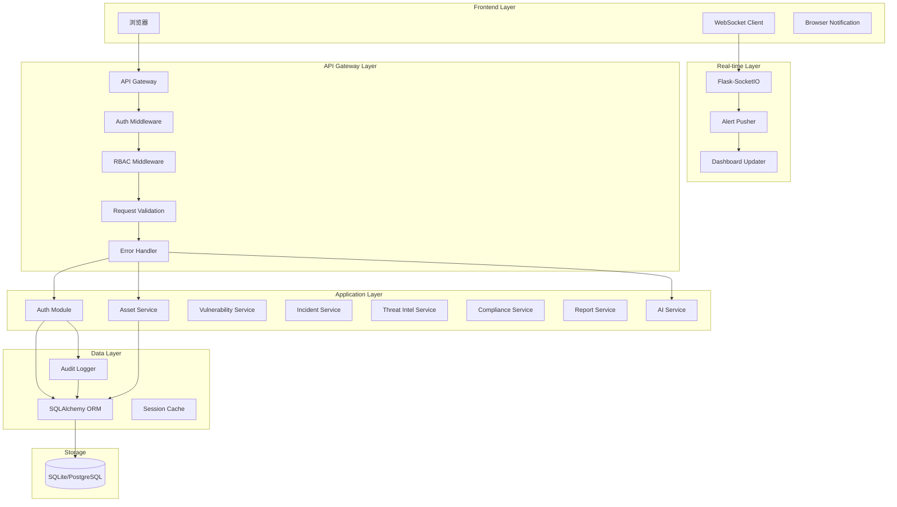

# Design Document: Security Platform Optimization

## Overview

本设计文档描述了 Flask 安全运营平台的优化架构设计。优化采用渐进式策略，分为六个主要模块，每个模块可独立部署和测试。

### 设计原则

1. **向后兼容**：新功能不破坏现有功能
2. **渐进增强**：每个阶段都能独立运行
3. **关注点分离**：各模块职责清晰
4. **可测试性**：所有核心逻辑可单元测试

### 技术选型

| 功能领域 | 技术选择 | 理由 |
|---------|---------|------|
| 数据库 ORM | SQLAlchemy 2.0 | Flask 生态标准，支持异步 |
| 数据库迁移 | Flask-Migrate (Alembic) | 成熟稳定，版本控制友好 |
| 用户认证 | Flask-Login | 轻量级，与 Flask 深度集成 |
| 密码哈希 | bcrypt | 安全性高，抗暴力破解 |
| WebSocket | Flask-SocketIO | 支持多种传输协议，易于集成 |
| 请求验证 | marshmallow | 灵活的序列化/反序列化 |
| API 文档 | flasgger (Swagger) | 自动生成交互式文档 |
| 前端构建 | esbuild | 极快的构建速度 |

## Architecture

### 系统架构图



### 目录结构

```
security-platform-flask/
├── app.py                      # 应用入口
├── config.py                   # 配置管理
├── extensions.py               # Flask 扩展初始化
├── models/                     # SQLAlchemy 数据模型
│   ├── __init__.py
│   ├── user.py                 # 用户和角色模型
│   ├── asset.py                # 资产模型
│   ├── vulnerability.py        # 漏洞模型
│   ├── incident.py             # 事件模型
│   ├── threat_intel.py         # 威胁情报模型
│   ├── compliance.py           # 合规模型
│   └── audit.py                # 审计日志模型
├── routes/                     # API 路由
│   ├── __init__.py
│   ├── auth.py                 # 认证路由
│   └── ...                     # 现有路由
├── services/                   # 业务逻辑层
│   ├── __init__.py
│   ├── auth_service.py         # 认证服务
│   ├── ai_service.py           # AI 分析服务
│   └── audit_service.py        # 审计服务
├── middleware/                 # 中间件
│   ├── __init__.py
│   ├── auth.py                 # 认证中间件
│   ├── rbac.py                 # RBAC 中间件
│   └── error_handler.py        # 错误处理
├── schemas/                    # 请求/响应模式
│   ├── __init__.py
│   ├── auth.py                 # 认证模式
│   └── common.py               # 通用模式
├── sockets/                    # WebSocket 处理
│   ├── __init__.py
│   └── alerts.py               # 告警推送
├── static/
│   ├── js/
│   │   ├── modules/            # JS 模块
│   │   │   ├── api.js          # API 客户端
│   │   │   ├── websocket.js    # WebSocket 客户端
│   │   │   ├── notification.js # 通知组件
│   │   │   └── components/     # UI 组件
│   │   ├── pages/              # 页面模块
│   │   └── app.js              # 主入口
│   └── style.css
├── templates/
│   ├── auth/
│   │   └── login.html          # 登录页面
│   └── ...
├── migrations/                 # 数据库迁移
└── tests/                      # 测试
    ├── test_auth.py
    ├── test_rbac.py
    └── ...
```

## Components and Interfaces

### 1. 认证模块 (Auth Module)

#### Flask-Login 集成

```python
# extensions.py
from flask_login import LoginManager
from flask_bcrypt import Bcrypt

login_manager = LoginManager()
bcrypt = Bcrypt()

# 配置
login_manager.login_view = 'auth.login'
login_manager.login_message = '请先登录'
login_manager.session_protection = 'strong'
```

#### 认证服务接口

```python
# services/auth_service.py
class AuthService:
    def authenticate(self, username: str, password: str) -> User | None:
        """验证用户凭证，返回用户对象或 None"""
        pass
    
    def create_user(self, username: str, password: str, roles: list[str]) -> User:
        """创建新用户"""
        pass
    
    def change_password(self, user_id: str, old_password: str, new_password: str) -> bool:
        """修改密码"""
        pass
    
    def validate_session(self, session_id: str) -> bool:
        """验证会话有效性"""
        pass
```

#### 认证路由

```python
# routes/auth.py
@auth_bp.route('/login', methods=['GET', 'POST'])
def login():
    """登录页面和处理"""
    pass

@auth_bp.route('/logout')
@login_required
def logout():
    """登出"""
    pass

@auth_bp.route('/api/auth/me')
@login_required
def get_current_user():
    """获取当前用户信息"""
    pass
```

### 2. RBAC 模块

#### 权限装饰器

```python
# middleware/rbac.py
from functools import wraps
from flask import abort
from flask_login import current_user

def require_role(*roles):
    """要求用户具有指定角色之一"""
    def decorator(f):
        @wraps(f)
        def decorated_function(*args, **kwargs):
            if not current_user.is_authenticated:
                abort(401)
            if not current_user.has_any_role(roles):
                abort(403)
            return f(*args, **kwargs)
        return decorated_function
    return decorator

def require_permission(permission: str):
    """要求用户具有指定权限"""
    def decorator(f):
        @wraps(f)
        def decorated_function(*args, **kwargs):
            if not current_user.is_authenticated:
                abort(401)
            if not current_user.has_permission(permission):
                abort(403)
            return f(*args, **kwargs)
        return decorated_function
    return decorator
```

#### 角色定义

```python
# 预定义角色和权限
ROLES = {
    'admin': {
        'description': '系统管理员',
        'permissions': ['*']  # 所有权限
    },
    'analyst': {
        'description': '安全分析师',
        'permissions': [
            'assets:read', 'assets:write',
            'vulnerabilities:read', 'vulnerabilities:write',
            'incidents:read', 'incidents:write',
            'threat_intel:read', 'threat_intel:write',
            'reports:read', 'reports:generate',
            'ai:analyze'
        ]
    },
    'viewer': {
        'description': '只读用户',
        'permissions': [
            'assets:read', 'vulnerabilities:read',
            'incidents:read', 'threat_intel:read',
            'reports:read', 'compliance:read'
        ]
    }
}
```

### 3. 审计日志模块

#### 审计装饰器

```python
# services/audit_service.py
from functools import wraps
from flask import request
from flask_login import current_user

def audit_action(action_type: str, resource_type: str):
    """记录操作审计日志的装饰器"""
    def decorator(f):
        @wraps(f)
        def decorated_function(*args, **kwargs):
            result = f(*args, **kwargs)
            AuditService.log(
                user_id=current_user.id if current_user.is_authenticated else None,
                action_type=action_type,
                resource_type=resource_type,
                resource_id=kwargs.get('id'),
                details=request.json,
                ip_address=request.remote_addr
            )
            return result
        return decorated_function
    return decorator

class AuditService:
    @staticmethod
    def log(user_id, action_type, resource_type, resource_id=None, 
            details=None, ip_address=None):
        """记录审计日志"""
        pass
    
    @staticmethod
    def query(start_time=None, end_time=None, user_id=None, 
              action_type=None, page=1, page_size=50):
        """查询审计日志"""
        pass
```

### 4. WebSocket 模块

#### SocketIO 初始化

```python
# extensions.py
from flask_socketio import SocketIO

socketio = SocketIO(cors_allowed_origins="*")
```

#### 告警推送服务

```python
# sockets/alerts.py
from flask_socketio import emit, join_room, leave_room
from flask_login import current_user

@socketio.on('connect')
def handle_connect():
    """处理 WebSocket 连接"""
    if not current_user.is_authenticated:
        return False  # 拒绝连接
    # 加入用户专属房间
    join_room(f'user_{current_user.id}')
    # 根据权限加入告警房间
    join_room('alerts_all')

@socketio.on('subscribe_alerts')
def handle_subscribe(data):
    """订阅特定级别的告警"""
    severity = data.get('severity', 'all')
    join_room(f'alerts_{severity}')

def push_alert(alert: dict, severity: str = 'all'):
    """推送告警到客户端"""
    socketio.emit('new_alert', alert, room=f'alerts_{severity}')
    if severity in ['critical', 'high']:
        socketio.emit('new_alert', alert, room='alerts_all')

def push_dashboard_update(data: dict):
    """推送仪表盘数据更新"""
    socketio.emit('dashboard_update', data, room='dashboard')
```

### 5. AI 服务模块

#### OpenAI 集成

```python
# services/ai_service.py
from openai import OpenAI
from flask import current_app, stream_with_context
import json

class AIService:
    def __init__(self):
        self.client = None
    
    def _get_client(self):
        if not self.client:
            api_key = current_app.config.get('OPENAI_API_KEY')
            if not api_key:
                raise ValueError("OpenAI API key not configured")
            self.client = OpenAI(api_key=api_key)
        return self.client
    
    def analyze_logs(self, logs: list[dict], stream: bool = False):
        """分析安全日志"""
        prompt = self._build_log_analysis_prompt(logs)
        
        if stream:
            return self._stream_completion(prompt)
        return self._get_completion(prompt)
    
    def detect_threats(self, data: dict):
        """检测潜在威胁"""
        prompt = self._build_threat_detection_prompt(data)
        return self._get_completion(prompt)
    
    def _stream_completion(self, prompt: str):
        """流式响应"""
        client = self._get_client()
        response = client.chat.completions.create(
            model="gpt-4",
            messages=[{"role": "user", "content": prompt}],
            stream=True
        )
        for chunk in response:
            if chunk.choices[0].delta.content:
                yield chunk.choices[0].delta.content
    
    def _sanitize_data(self, data: dict) -> dict:
        """脱敏处理敏感数据"""
        # 移除或掩码敏感字段
        sensitive_fields = ['password', 'token', 'secret', 'key']
        sanitized = {}
        for k, v in data.items():
            if any(s in k.lower() for s in sensitive_fields):
                sanitized[k] = '***REDACTED***'
            else:
                sanitized[k] = v
        return sanitized
```

### 6. API Gateway 模块

#### 统一响应格式

```python
# middleware/response.py
from flask import jsonify
from functools import wraps

def api_response(data=None, message=None, status_code=200):
    """统一成功响应格式"""
    response = {
        'success': True,
        'data': data,
        'message': message
    }
    return jsonify(response), status_code

def paginated_response(items, total, page, page_size):
    """分页响应格式"""
    return api_response({
        'items': items,
        'total': total,
        'page': page,
        'page_size': page_size,
        'total_pages': (total + page_size - 1) // page_size
    })

def error_response(code, message, status_code=400):
    """统一错误响应格式"""
    response = {
        'success': False,
        'error': {
            'code': code,
            'message': message
        }
    }
    return jsonify(response), status_code
```

#### 全局错误处理

```python
# middleware/error_handler.py
from flask import Blueprint, jsonify
from werkzeug.exceptions import HTTPException
from marshmallow import ValidationError

def register_error_handlers(app):
    @app.errorhandler(ValidationError)
    def handle_validation_error(e):
        return error_response('VALIDATION_ERROR', str(e.messages), 400)
    
    @app.errorhandler(401)
    def handle_unauthorized(e):
        return error_response('UNAUTHORIZED', '请先登录', 401)
    
    @app.errorhandler(403)
    def handle_forbidden(e):
        return error_response('FORBIDDEN', '权限不足', 403)
    
    @app.errorhandler(404)
    def handle_not_found(e):
        return error_response('NOT_FOUND', '资源不存在', 404)
    
    @app.errorhandler(500)
    def handle_internal_error(e):
        app.logger.error(f'Internal error: {e}')
        return error_response('INTERNAL_ERROR', '服务器内部错误', 500)
```

#### 请求验证

```python
# schemas/common.py
from marshmallow import Schema, fields, validate

class PaginationSchema(Schema):
    page = fields.Int(load_default=1, validate=validate.Range(min=1))
    page_size = fields.Int(load_default=20, validate=validate.Range(min=1, max=100))

class AssetCreateSchema(Schema):
    name = fields.Str(required=True, validate=validate.Length(min=1, max=200))
    type = fields.Str(required=True, validate=validate.OneOf(
        ['server', 'endpoint', 'network', 'application', 'database', 'cloud']
    ))
    ip = fields.Str(required=True)
    owner = fields.Str()
    department = fields.Str()
    criticality = fields.Str(validate=validate.OneOf(
        ['critical', 'high', 'medium', 'low']
    ))
    tags = fields.List(fields.Str())

def validate_request(schema_class):
    """请求验证装饰器"""
    def decorator(f):
        @wraps(f)
        def decorated_function(*args, **kwargs):
            schema = schema_class()
            data = schema.load(request.json or {})
            return f(data, *args, **kwargs)
        return decorated_function
    return decorator
```

### 7. 前端模块

#### API 客户端模块

```javascript
// static/js/modules/api.js
class ApiClient {
    constructor(baseUrl = '/api') {
        this.baseUrl = baseUrl;
    }

    async request(endpoint, options = {}) {
        const url = `${this.baseUrl}${endpoint}`;
        const config = {
            headers: { 'Content-Type': 'application/json' },
            ...options
        };

        try {
            const response = await fetch(url, config);
            const data = await response.json();
            
            if (!response.ok) {
                throw new ApiError(data.error?.code, data.error?.message, response.status);
            }
            
            return data.data;
        } catch (error) {
            if (error instanceof ApiError) throw error;
            throw new ApiError('NETWORK_ERROR', '网络连接失败');
        }
    }

    get(endpoint, params = {}) {
        const query = new URLSearchParams(params).toString();
        const url = query ? `${endpoint}?${query}` : endpoint;
        return this.request(url);
    }

    post(endpoint, data) {
        return this.request(endpoint, {
            method: 'POST',
            body: JSON.stringify(data)
        });
    }

    patch(endpoint, data) {
        return this.request(endpoint, {
            method: 'PATCH',
            body: JSON.stringify(data)
        });
    }

    delete(endpoint) {
        return this.request(endpoint, { method: 'DELETE' });
    }
}

class ApiError extends Error {
    constructor(code, message, status) {
        super(message);
        this.code = code;
        this.status = status;
    }
}

export const api = new ApiClient();
export { ApiError };
```

#### WebSocket 客户端模块

```javascript
// static/js/modules/websocket.js
import { io } from 'socket.io-client';

class WebSocketClient {
    constructor() {
        this.socket = null;
        this.reconnectAttempts = 0;
        this.maxReconnectAttempts = 5;
        this.listeners = new Map();
    }

    connect() {
        this.socket = io({
            transports: ['websocket', 'polling'],
            reconnection: true,
            reconnectionDelay: 1000,
            reconnectionDelayMax: 5000
        });

        this.socket.on('connect', () => {
            console.log('WebSocket connected');
            this.reconnectAttempts = 0;
            this._emit('connected');
        });

        this.socket.on('disconnect', () => {
            console.log('WebSocket disconnected');
            this._emit('disconnected');
        });

        this.socket.on('new_alert', (alert) => {
            this._emit('alert', alert);
        });

        this.socket.on('dashboard_update', (data) => {
            this._emit('dashboard', data);
        });
    }

    subscribeAlerts(severity = 'all') {
        this.socket?.emit('subscribe_alerts', { severity });
    }

    on(event, callback) {
        if (!this.listeners.has(event)) {
            this.listeners.set(event, []);
        }
        this.listeners.get(event).push(callback);
    }

    _emit(event, data) {
        const callbacks = this.listeners.get(event) || [];
        callbacks.forEach(cb => cb(data));
    }
}

export const wsClient = new WebSocketClient();
```

#### 通知组件

```javascript
// static/js/modules/notification.js
class NotificationManager {
    constructor() {
        this.container = null;
        this.browserPermission = 'default';
    }

    init() {
        this._createContainer();
        this._requestBrowserPermission();
    }

    _createContainer() {
        this.container = document.createElement('div');
        this.container.className = 'notification-container';
        document.body.appendChild(this.container);
    }

    async _requestBrowserPermission() {
        if ('Notification' in window) {
            this.browserPermission = await Notification.requestPermission();
        }
    }

    show(message, type = 'info', duration = 3000) {
        const notification = document.createElement('div');
        notification.className = `notification notification-${type}`;
        notification.innerHTML = `
            <span class="notification-message">${message}</span>
            <button class="notification-close">&times;</button>
        `;
        
        notification.querySelector('.notification-close').onclick = () => {
            notification.remove();
        };

        this.container.appendChild(notification);
        
        if (duration > 0) {
            setTimeout(() => notification.remove(), duration);
        }
    }

    success(message) { this.show(message, 'success'); }
    error(message) { this.show(message, 'error', 5000); }
    warning(message) { this.show(message, 'warning'); }
    info(message) { this.show(message, 'info'); }

    browserNotify(title, options = {}) {
        if (this.browserPermission === 'granted') {
            const notification = new Notification(title, {
                icon: '/static/icon.png',
                ...options
            });
            notification.onclick = () => {
                window.focus();
                if (options.url) window.location.href = options.url;
            };
        }
    }
}

export const notify = new NotificationManager();
```

## Data Models

### 用户和角色模型

```python
# models/user.py
from extensions import db
from flask_login import UserMixin
from datetime import datetime
import uuid

# 用户-角色关联表
user_roles = db.Table('user_roles',
    db.Column('user_id', db.String(36), db.ForeignKey('users.id'), primary_key=True),
    db.Column('role_id', db.String(36), db.ForeignKey('roles.id'), primary_key=True)
)

class User(UserMixin, db.Model):
    __tablename__ = 'users'
    
    id = db.Column(db.String(36), primary_key=True, default=lambda: str(uuid.uuid4()))
    username = db.Column(db.String(80), unique=True, nullable=False, index=True)
    email = db.Column(db.String(120), unique=True, nullable=False)
    password_hash = db.Column(db.String(128), nullable=False)
    is_active = db.Column(db.Boolean, default=True)
    created_at = db.Column(db.DateTime, default=datetime.utcnow)
    updated_at = db.Column(db.DateTime, default=datetime.utcnow, onupdate=datetime.utcnow)
    last_login = db.Column(db.DateTime)
    
    roles = db.relationship('Role', secondary=user_roles, backref='users')
    
    def has_role(self, role_name: str) -> bool:
        return any(r.name == role_name for r in self.roles)
    
    def has_any_role(self, role_names: list) -> bool:
        return any(self.has_role(r) for r in role_names)
    
    def has_permission(self, permission: str) -> bool:
        for role in self.roles:
            if '*' in role.permissions or permission in role.permissions:
                return True
        return False

class Role(db.Model):
    __tablename__ = 'roles'
    
    id = db.Column(db.String(36), primary_key=True, default=lambda: str(uuid.uuid4()))
    name = db.Column(db.String(50), unique=True, nullable=False)
    description = db.Column(db.String(200))
    permissions = db.Column(db.JSON, default=list)
    created_at = db.Column(db.DateTime, default=datetime.utcnow)
```

### 审计日志模型

```python
# models/audit.py
from extensions import db
from datetime import datetime
import uuid

class AuditLog(db.Model):
    __tablename__ = 'audit_logs'
    
    id = db.Column(db.String(36), primary_key=True, default=lambda: str(uuid.uuid4()))
    timestamp = db.Column(db.DateTime, default=datetime.utcnow, index=True)
    user_id = db.Column(db.String(36), db.ForeignKey('users.id'), index=True)
    username = db.Column(db.String(80))
    action_type = db.Column(db.String(50), nullable=False, index=True)  # create, update, delete, login, logout
    resource_type = db.Column(db.String(50), index=True)  # asset, vulnerability, incident, etc.
    resource_id = db.Column(db.String(36))
    details = db.Column(db.JSON)
    ip_address = db.Column(db.String(45))
    user_agent = db.Column(db.String(500))
    
    user = db.relationship('User', backref='audit_logs')
    
    __table_args__ = (
        db.Index('idx_audit_time_user', 'timestamp', 'user_id'),
        db.Index('idx_audit_resource', 'resource_type', 'resource_id'),
    )
```

### 资产模型

```python
# models/asset.py
from extensions import db
from datetime import datetime
import uuid

class Asset(db.Model):
    __tablename__ = 'assets'
    
    id = db.Column(db.String(36), primary_key=True, default=lambda: str(uuid.uuid4()))
    name = db.Column(db.String(200), nullable=False)
    type = db.Column(db.String(50), nullable=False, index=True)  # server, endpoint, network, application, database, cloud
    ip = db.Column(db.String(45), index=True)
    os = db.Column(db.String(100))
    owner = db.Column(db.String(100))
    department = db.Column(db.String(100), index=True)
    criticality = db.Column(db.String(20), default='medium')  # critical, high, medium, low
    status = db.Column(db.String(20), default='online')  # online, offline, maintenance
    risk_score = db.Column(db.Integer, default=0)
    tags = db.Column(db.JSON, default=list)
    compliant = db.Column(db.Boolean, default=True)
    patch_pending = db.Column(db.Boolean, default=False)
    last_scan = db.Column(db.DateTime)
    created_at = db.Column(db.DateTime, default=datetime.utcnow)
    updated_at = db.Column(db.DateTime, default=datetime.utcnow, onupdate=datetime.utcnow)
    
    vulnerabilities = db.relationship('Vulnerability', secondary='asset_vulnerabilities', backref='assets')
```

### 漏洞模型

```python
# models/vulnerability.py
from extensions import db
from datetime import datetime
import uuid

asset_vulnerabilities = db.Table('asset_vulnerabilities',
    db.Column('asset_id', db.String(36), db.ForeignKey('assets.id'), primary_key=True),
    db.Column('vulnerability_id', db.String(36), db.ForeignKey('vulnerabilities.id'), primary_key=True)
)

class Vulnerability(db.Model):
    __tablename__ = 'vulnerabilities'
    
    id = db.Column(db.String(36), primary_key=True, default=lambda: str(uuid.uuid4()))
    cve_id = db.Column(db.String(20), index=True)
    title = db.Column(db.String(300), nullable=False)
    description = db.Column(db.Text)
    severity = db.Column(db.String(20), nullable=False, index=True)  # critical, high, medium, low
    cvss_score = db.Column(db.Float)
    status = db.Column(db.String(20), default='open', index=True)  # open, in_progress, fixed, accepted
    remediation = db.Column(db.Text)
    references = db.Column(db.JSON, default=list)
    discovered_at = db.Column(db.DateTime, default=datetime.utcnow)
    fixed_at = db.Column(db.DateTime)
    created_at = db.Column(db.DateTime, default=datetime.utcnow)
    updated_at = db.Column(db.DateTime, default=datetime.utcnow, onupdate=datetime.utcnow)
```

### 事件模型

```python
# models/incident.py
from extensions import db
from datetime import datetime
import uuid

class Incident(db.Model):
    __tablename__ = 'incidents'
    
    id = db.Column(db.String(36), primary_key=True, default=lambda: str(uuid.uuid4()))
    title = db.Column(db.String(300), nullable=False)
    type = db.Column(db.String(50), nullable=False, index=True)  # malware, unauthorized_access, data_breach, phishing, etc.
    severity = db.Column(db.String(20), nullable=False, index=True)  # critical, high, medium, low
    status = db.Column(db.String(20), default='new', index=True)  # new, investigating, containing, eradicating, recovering, closed
    description = db.Column(db.Text)
    assignee_id = db.Column(db.String(36), db.ForeignKey('users.id'))
    affected_assets = db.Column(db.JSON, default=list)
    created_at = db.Column(db.DateTime, default=datetime.utcnow)
    updated_at = db.Column(db.DateTime, default=datetime.utcnow, onupdate=datetime.utcnow)
    closed_at = db.Column(db.DateTime)
    
    assignee = db.relationship('User', backref='assigned_incidents')
    timeline = db.relationship('IncidentTimeline', backref='incident', order_by='IncidentTimeline.timestamp')

class IncidentTimeline(db.Model):
    __tablename__ = 'incident_timeline'
    
    id = db.Column(db.String(36), primary_key=True, default=lambda: str(uuid.uuid4()))
    incident_id = db.Column(db.String(36), db.ForeignKey('incidents.id'), nullable=False)
    type = db.Column(db.String(50), nullable=False)  # created, status_change, comment, playbook, etc.
    action = db.Column(db.String(500), nullable=False)
    user_id = db.Column(db.String(36), db.ForeignKey('users.id'))
    timestamp = db.Column(db.DateTime, default=datetime.utcnow)
    
    user = db.relationship('User')
```

### 威胁情报模型

```python
# models/threat_intel.py
from extensions import db
from datetime import datetime
import uuid

class IOC(db.Model):
    __tablename__ = 'iocs'
    
    id = db.Column(db.String(36), primary_key=True, default=lambda: str(uuid.uuid4()))
    type = db.Column(db.String(20), nullable=False, index=True)  # ip, domain, hash, url, email
    value = db.Column(db.String(500), nullable=False, index=True)
    threat_type = db.Column(db.String(100))
    confidence = db.Column(db.Integer, default=50)  # 0-100
    source = db.Column(db.String(100))
    first_seen = db.Column(db.DateTime, default=datetime.utcnow)
    last_seen = db.Column(db.DateTime, default=datetime.utcnow)
    created_at = db.Column(db.DateTime, default=datetime.utcnow)
    
    __table_args__ = (
        db.Index('idx_ioc_type_value', 'type', 'value'),
    )

class ThreatFeed(db.Model):
    __tablename__ = 'threat_feeds'
    
    id = db.Column(db.String(36), primary_key=True, default=lambda: str(uuid.uuid4()))
    name = db.Column(db.String(100), nullable=False)
    type = db.Column(db.String(50))  # STIX/TAXII, API, RSS
    url = db.Column(db.String(500))
    api_key = db.Column(db.String(200))
    enabled = db.Column(db.Boolean, default=True)
    last_update = db.Column(db.DateTime)
    ioc_count = db.Column(db.Integer, default=0)
    created_at = db.Column(db.DateTime, default=datetime.utcnow)
```

### 合规检查模型

```python
# models/compliance.py
from extensions import db
from datetime import datetime
import uuid

class ComplianceFramework(db.Model):
    __tablename__ = 'compliance_frameworks'
    
    id = db.Column(db.String(36), primary_key=True, default=lambda: str(uuid.uuid4()))
    name = db.Column(db.String(100), nullable=False)
    description = db.Column(db.Text)
    total_controls = db.Column(db.Integer, default=0)
    created_at = db.Column(db.DateTime, default=datetime.utcnow)
    
    checks = db.relationship('ComplianceCheck', backref='framework')

class ComplianceCheck(db.Model):
    __tablename__ = 'compliance_checks'
    
    id = db.Column(db.String(36), primary_key=True, default=lambda: str(uuid.uuid4()))
    framework_id = db.Column(db.String(36), db.ForeignKey('compliance_frameworks.id'), nullable=False)
    control_id = db.Column(db.String(50))
    title = db.Column(db.String(300), nullable=False)
    description = db.Column(db.Text)
    status = db.Column(db.String(20), default='pending')  # passed, failed, pending, not_applicable
    last_check = db.Column(db.DateTime)
    evidence = db.Column(db.Text)
    remediation = db.Column(db.Text)
```

## Correctness Properties

*A property is a characteristic or behavior that should hold true across all valid executions of a system—essentially, a formal statement about what the system should do. Properties serve as the bridge between human-readable specifications and machine-verifiable correctness guarantees.*

### Property 1: Password Hash Security

*For any* user password stored in the database, the stored value SHALL be a valid bcrypt hash (starting with `$2b$`) and SHALL NOT equal the plaintext password.

**Validates: Requirements 1.6**

### Property 2: Authentication Redirect

*For any* protected route and any unauthenticated request, the response SHALL be a redirect (302) to the login page.

**Validates: Requirements 1.1**

### Property 3: Valid Credentials Create Session

*For any* valid username/password combination, authenticating SHALL create a session and return a success response with session cookie.

**Validates: Requirements 1.2**

### Property 4: Invalid Credentials Rejection

*For any* invalid username or password, authenticating SHALL NOT create a session and SHALL return an error response.

**Validates: Requirements 1.3**

### Property 5: Logout Session Destruction

*For any* authenticated session, after logout the session token SHALL be invalid for subsequent requests.

**Validates: Requirements 1.4**

### Property 6: RBAC Permission Enforcement

*For any* user without required permission and any protected endpoint, the request SHALL return 403 Forbidden status.

**Validates: Requirements 2.2**

### Property 7: Role Assignment Persistence

*For any* user with assigned roles, querying the user SHALL return all assigned roles, and the user SHALL have permissions from all assigned roles.

**Validates: Requirements 2.3**

### Property 8: Permission Update Immediacy

*For any* user whose roles are modified, the next request SHALL use the updated permissions (not cached old permissions).

**Validates: Requirements 2.5**

### Property 9: Audit Log Completeness

*For any* write operation (create, update, delete) on any resource, an audit log entry SHALL be created containing: timestamp, user_id, username, action_type, resource_type, resource_id, details, and ip_address.

**Validates: Requirements 3.1, 3.2**

### Property 10: Authentication Event Logging

*For any* login or logout action, an audit log entry with action_type 'login' or 'logout' SHALL be created.

**Validates: Requirements 3.3**

### Property 11: Audit Log Query Filtering

*For any* audit log query with filters (time range, user, action type), the returned results SHALL only contain entries matching ALL specified filters.

**Validates: Requirements 3.4**

### Property 12: Audit Log Immutability

*For any* non-admin user, attempts to modify or delete audit logs SHALL be rejected with 403 status.

**Validates: Requirements 3.5**

### Property 13: WebSocket Authentication

*For any* WebSocket connection attempt without valid session, the connection SHALL be rejected.

**Validates: Requirements 6.2**

### Property 14: Alert Broadcasting

*For any* new alert created, all connected WebSocket clients subscribed to 'alerts_all' or the matching severity channel SHALL receive the alert.

**Validates: Requirements 6.3**

### Property 15: Alert Subscription Filtering

*For any* client subscribed to a specific severity level, they SHALL only receive alerts of that severity (plus critical alerts which go to all).

**Validates: Requirements 6.4**

### Property 16: Dashboard Update Broadcasting

*For any* change in security metrics, all clients subscribed to 'dashboard' channel SHALL receive the update.

**Validates: Requirements 7.2**

### Property 17: AI Data Sanitization

*For any* input data containing sensitive fields (password, token, secret, key), the data sent to OpenAI API SHALL have those fields redacted.

**Validates: Requirements 9.6**

### Property 18: AI Error Handling

*For any* OpenAI API failure, the response SHALL contain a user-friendly error message and the error SHALL be logged.

**Validates: Requirements 9.4**

### Property 19: AI Rate Limiting

*For any* sequence of AI requests exceeding the rate limit, subsequent requests SHALL be rejected with rate limit error until the window resets.

**Validates: Requirements 9.5**

### Property 20: Threat Detection Response Completeness

*For any* threat detection response containing threats, each threat SHALL have a confidence score (0-100) and a recommendation string.

**Validates: Requirements 10.2, 10.3**

### Property 21: Threat Detection Risk Rating

*For any* threat detection response, it SHALL contain an overall_risk field with value in ['low', 'medium', 'high', 'critical'].

**Validates: Requirements 10.4**

### Property 22: API Success Response Format

*For any* successful API response, the JSON body SHALL contain `success: true` and a `data` field.

**Validates: Requirements 14.1**

### Property 23: API Error Response Format

*For any* error API response, the JSON body SHALL contain `success: false` and an `error` object with `code` and `message` fields.

**Validates: Requirements 14.2**

### Property 24: API Pagination Format

*For any* list API endpoint response, the data SHALL contain `items` (array), `total` (integer), `page` (integer), and `page_size` (integer) fields.

**Validates: Requirements 14.3**

### Property 25: API Request Trace ID

*For any* API response, the response headers SHALL contain an `X-Request-ID` header with a non-empty value.

**Validates: Requirements 14.4**

### Property 26: HTTP Status Code Correctness

*For any* validation error the status SHALL be 400, for authentication error 401, for permission error 403, for not found 404, and for internal error 500.

**Validates: Requirements 15.2, 15.3, 15.4, 15.5, 15.6**

### Property 27: Validation Error Details

*For any* request with invalid data, the error response SHALL contain field-level validation error messages.

**Validates: Requirements 16.2**

### Property 28: Input Sanitization

*For any* input containing HTML/script tags or SQL injection patterns, those dangerous characters SHALL be escaped or removed before processing.

**Validates: Requirements 16.4**

### Property 29: ID Format Validation

*For any* request with an invalid UUID format in ID parameters, the response SHALL be 400 with validation error.

**Validates: Requirements 16.5**

### Property 30: Frontend Error Type Differentiation

*For any* API error, the frontend SHALL display different messages for network errors, authentication errors (401), permission errors (403), and server errors (500).

**Validates: Requirements 13.4**

## Error Handling

### 后端错误处理策略

#### 错误分类

| 错误类型 | HTTP 状态码 | 错误代码 | 处理方式 |
|---------|------------|---------|---------|
| 验证错误 | 400 | VALIDATION_ERROR | 返回字段级错误详情 |
| 认证错误 | 401 | UNAUTHORIZED | 重定向到登录或返回 JSON |
| 权限错误 | 403 | FORBIDDEN | 返回权限不足消息 |
| 资源不存在 | 404 | NOT_FOUND | 返回资源类型和 ID |
| 速率限制 | 429 | RATE_LIMITED | 返回重试时间 |
| 服务器错误 | 500 | INTERNAL_ERROR | 记录详细日志，返回通用消息 |

#### 错误日志记录

```python
# 错误日志格式
{
    "timestamp": "2024-01-15T10:30:00Z",
    "level": "ERROR",
    "request_id": "uuid",
    "user_id": "uuid or null",
    "path": "/api/assets",
    "method": "POST",
    "error_type": "ValidationError",
    "error_message": "详细错误信息",
    "stack_trace": "...",
    "request_body": "{...}",  # 脱敏后
    "ip_address": "192.168.1.1"
}
```

### 前端错误处理策略

#### 错误类型映射

```javascript
const ERROR_MESSAGES = {
    NETWORK_ERROR: '网络连接失败，请检查网络设置',
    UNAUTHORIZED: '登录已过期，请重新登录',
    FORBIDDEN: '您没有权限执行此操作',
    NOT_FOUND: '请求的资源不存在',
    VALIDATION_ERROR: '输入数据有误，请检查后重试',
    RATE_LIMITED: '请求过于频繁，请稍后重试',
    INTERNAL_ERROR: '服务器错误，请稍后重试'
};
```

#### 全局错误处理

```javascript
// 未捕获异常处理
window.onerror = (message, source, lineno, colno, error) => {
    console.error('Uncaught error:', { message, source, lineno, colno, error });
    notify.error('发生未知错误，请刷新页面重试');
};

// Promise 拒绝处理
window.onunhandledrejection = (event) => {
    console.error('Unhandled rejection:', event.reason);
    if (event.reason instanceof ApiError) {
        handleApiError(event.reason);
    }
};
```

## Testing Strategy

### 测试框架选择

| 测试类型 | 框架 | 用途 |
|---------|------|------|
| 单元测试 | pytest | 后端业务逻辑测试 |
| 属性测试 | hypothesis | 后端属性验证 |
| API 测试 | pytest + Flask test client | API 端点测试 |
| 前端单元测试 | Jest | JavaScript 模块测试 |
| 前端属性测试 | fast-check | 前端属性验证 |
| E2E 测试 | Playwright | 端到端流程测试 |

### 属性测试配置

```python
# conftest.py
from hypothesis import settings, Verbosity

settings.register_profile("ci", max_examples=100)
settings.register_profile("dev", max_examples=10)
settings.load_profile("ci")
```

### 测试覆盖要求

- 单元测试覆盖率目标：80%
- 所有 Correctness Properties 必须有对应的属性测试
- 关键业务流程必须有 E2E 测试

### 属性测试示例

```python
# tests/test_auth_properties.py
from hypothesis import given, strategies as st
import pytest

# Feature: security-platform-optimization, Property 1: Password Hash Security
@given(password=st.text(min_size=8, max_size=128))
def test_password_hash_security(password):
    """For any password, stored hash should be bcrypt and not equal plaintext"""
    from services.auth_service import AuthService
    
    hashed = AuthService.hash_password(password)
    
    assert hashed.startswith('$2b$'), "Hash should be bcrypt format"
    assert hashed != password, "Hash should not equal plaintext"
    assert AuthService.verify_password(password, hashed), "Hash should verify"

# Feature: security-platform-optimization, Property 6: RBAC Permission Enforcement
@given(
    user_role=st.sampled_from(['viewer', 'analyst']),
    required_permission=st.sampled_from(['admin:write', 'settings:write'])
)
def test_rbac_permission_enforcement(client, user_role, required_permission):
    """For any user without required permission, request should return 403"""
    # Setup user with role
    user = create_test_user(role=user_role)
    login(client, user)
    
    # Try to access protected endpoint
    response = client.post('/api/settings/config')
    
    assert response.status_code == 403

# Feature: security-platform-optimization, Property 9: Audit Log Completeness
@given(
    action_type=st.sampled_from(['create', 'update', 'delete']),
    resource_type=st.sampled_from(['asset', 'vulnerability', 'incident'])
)
def test_audit_log_completeness(client, auth_user, action_type, resource_type):
    """For any write operation, audit log should contain all required fields"""
    # Perform write operation
    perform_write_operation(client, action_type, resource_type)
    
    # Check audit log
    log = get_latest_audit_log()
    
    required_fields = ['timestamp', 'user_id', 'username', 'action_type', 
                       'resource_type', 'resource_id', 'details', 'ip_address']
    for field in required_fields:
        assert field in log, f"Audit log missing field: {field}"
```

### 前端属性测试示例

```javascript
// tests/api.property.test.js
import * as fc from 'fast-check';
import { ApiClient, ApiError } from '../static/js/modules/api';

// Feature: security-platform-optimization, Property 22: API Success Response Format
test('API success response format', async () => {
    await fc.assert(
        fc.asyncProperty(
            fc.record({
                items: fc.array(fc.object()),
                total: fc.nat()
            }),
            async (mockData) => {
                // Mock successful response
                global.fetch = jest.fn(() => 
                    Promise.resolve({
                        ok: true,
                        json: () => Promise.resolve({ success: true, data: mockData })
                    })
                );
                
                const api = new ApiClient();
                const result = await api.get('/test');
                
                expect(result).toEqual(mockData);
            }
        ),
        { numRuns: 100 }
    );
});

// Feature: security-platform-optimization, Property 30: Frontend Error Type Differentiation
test('Frontend error type differentiation', async () => {
    await fc.assert(
        fc.asyncProperty(
            fc.constantFrom(401, 403, 404, 500),
            async (statusCode) => {
                const errorCodes = {
                    401: 'UNAUTHORIZED',
                    403: 'FORBIDDEN', 
                    404: 'NOT_FOUND',
                    500: 'INTERNAL_ERROR'
                };
                
                global.fetch = jest.fn(() =>
                    Promise.resolve({
                        ok: false,
                        status: statusCode,
                        json: () => Promise.resolve({
                            success: false,
                            error: { code: errorCodes[statusCode], message: 'Test' }
                        })
                    })
                );
                
                const api = new ApiClient();
                
                await expect(api.get('/test')).rejects.toMatchObject({
                    code: errorCodes[statusCode],
                    status: statusCode
                });
            }
        ),
        { numRuns: 100 }
    );
});
```
